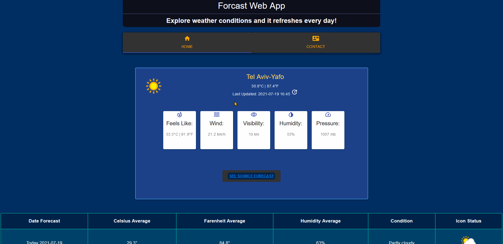

# Forecast Web App - Built with ReactJS + Material UI

## Demo
Try out demo at [Forecast Web App](https://forecast-web.netlify.app/).



## Get Started

1. Get free [WeatherAPI.com](https://rapidapi.com/weatherapi/api/weatherapi-com/) from [RapidAPI](https://rapidapi.com/marketplace) Marketplace
1. Clone `forcast-web-app/` and open with VS Code
1. Create new file `.env` in root directory and copy the following: 
```
# Replace 'Your_RapidAPI_Key' with your new API key below
REACT_APP_FORCAST_KEY=Your_RapidAPI_Key
```
4. Run terminal and type `npm install`, then `npm start`
5. Enjoy trying out at forecast status & table and contact form!